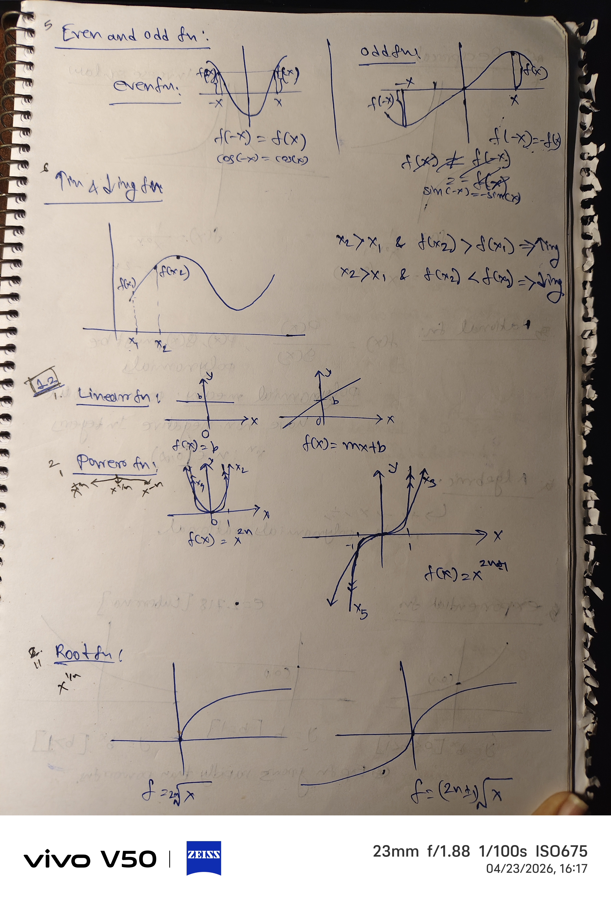
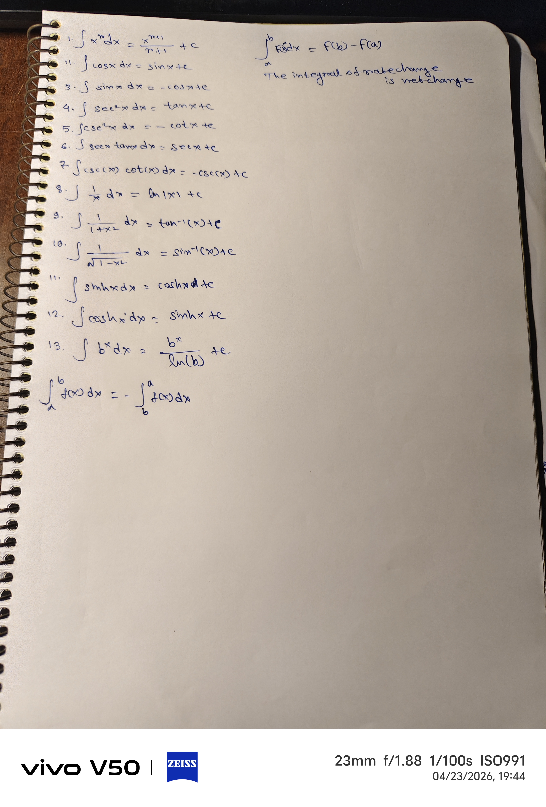

# 18.01-Single-Variable-Calculus

single variable calculus learning repository with problem solvings

Handwritten notes (for real understanding)
Problem-solving approach

it includes
- Intuition over memorization
- Mistakes and corrections
- Real thinking process

topics covered till now 
- Functions and Models
  - Different types of Functions 
  - Vertical line Test
  - linear Functions, Power Functions, Root Functions, Reciprocal Functions, Rational Functions, Algebric Functions, Exponential Functions, Inverse Log Functions
  - Inverse Trigonometric Functions
  - Rotation of axes
  - Combinations of Functions
  - Trig Identities
  - Triangle formula
  - Sigma Notations

- Limits and Derivatives
  - Rate of Change
  - How a limit cant exist
  - How a limit exists
  - Limit Laws
  - Continous Functions
  - Methods to solve
  - Squeeze Theorem
  - Precise Definitions of limits
  - Infinte Limits
  - Limits at Infinity
  - Infinte Limits at infinity
  - Methods to solve them
  - Continuity
  - A function is continous at number a
  - Discontinuity
  - Continous at an interval
  - Methods of Continous Functions
  - Intermediate Value Theorem
  - Definition of Derivitive
  - Tangent line at a point on a curve
  - Differentiability
  - Higher Derivatives

- Derivatives of Polynomial and Exponential Functions
  - Constant Functions
  - Power Rule
  - The Reason Discontinuity exists
  - Product and Quotient Rule
  - Constant Multiple Rule
  - Rate of Change
  - Derivatives of Trig Functions
  - Chain Rule
  - The Proof of Eulers number
  - Why Euler number is approx 2.71828
  - Non Differentiability
  - Implicit Differentiation
  - Growth Functions
  - Euler Number (e) as a limit
  - Linear Approximations
  - Quadratic Approximation
  - Derivative of Inverse Trigonometric Functions
  - Derivative of an Inverse
  - Hyperbolic Functions
  - Hyperbolic Identities
  - Derivative of Hyperbolic Functions
  - Derivative of Inverse Hyperbolic Functions
  - Hyperbolic functions into Log Functions
  - Maximum and Minimum
  - Supremum or Least Upper Bound
  - Infimum or Greatest Lower Bound
  - Application of Differentiation
    
- Integration
  - Common Integrations
  - Integral of Rate Change is Net Change
  - Riemann Sums
  - Mid-Point Approximation 
  - Integration Techniques
  - Areas Between Curves
  - Volumes of Solids of Revolution
  - Surface Area of Revolution
  - Indeterminate Forms
  - Integration by Parts
  - Trig Integrals
  - Trig Substitution
  - Improper Integrals
  - Partial Fractions
  - Comparison Test

## [One look pages](one-look-pages)
<table>
  <tr>
    <td></td>
    <td></td>
    <td></td>
  </tr>
  <tr>
    <td></td>
    <td></td>
    <td></td>
  </tr>
  <tr>
    <td></td>
  </tr>
</table>

<table>  
  <tr>
    <td></td>
    <td></td>
    <td></td>
  </tr>
  <tr>
    <td></td>
  </tr>
</table>

<table>  
  <tr>
    <td></td>
    <td></td>
    <td></td>
  </tr>
  <tr>
    <td></td>
  </tr>
</table>

<table>
  <tr>
    <td></td>
  </tr>
</table>

<table>
  <tr>
    <td></td>
    <td></td>
  </tr>
</table>

The repo is for 
- Students learning calculus from scratch
- Engineering students (especially AI, Quant)
- Anyone who wants deep conceptual clarity

Why this repo is different
- not ai generated notes
- this shows real learning process
- this shouws focuses on thinking, not copying

My Future goals
- I will add more advanced problems
- I want to include applications in physics and engineering
- I want to Connect calculus with programming
---

calculus, single variable calculus, 
MIT 18.01, integration, derivatives, 
engineering mathematics, problem solving, 
handwritten notes, deep learning math, quantitative finance math
