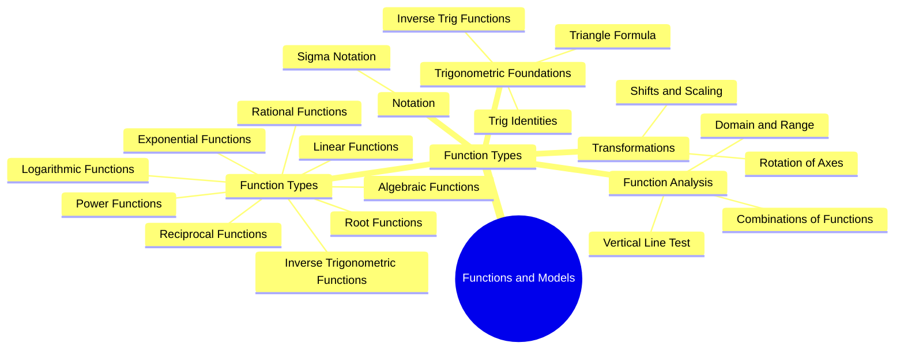
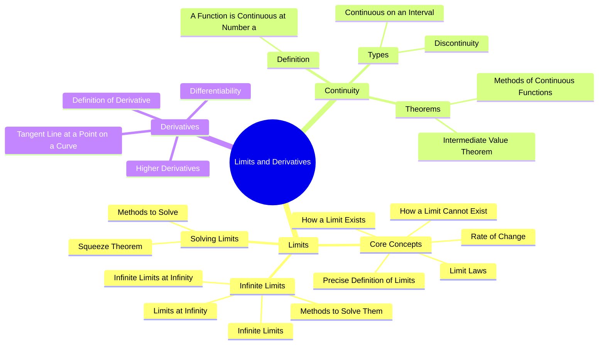
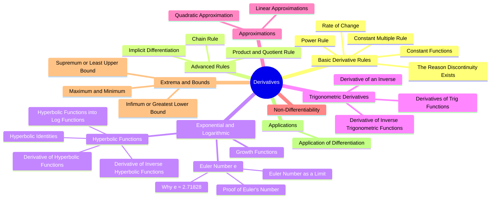
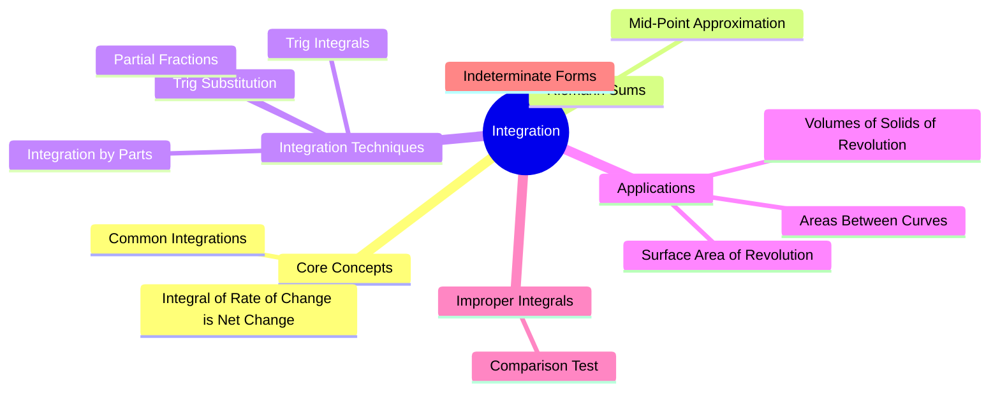

# 18.01-Single-Variable-Calculus

single variable calculus learning repository with problem solvings

Handwritten notes (for real understanding)
Problem-solving approach

it includes
- Functions and Models
- Limits and Derivatives
- Derivatives of Polynomial and Exponential Functions
- Integration
- Application of Integration

topics covered till now 

    

## [One look pages](one-look-pages)

## Functions and Models

<table>
  <tr>
    <td></td>
    <td></td>
    <td></td>
  </tr>
  <tr>
    <td></td>
    <td></td>
    <td></td>
  </tr>
  <tr>
    <td></td>
  </tr>
</table>

## Limits and Derivatives

<table>  
  <tr>
    <td></td>
    <td></td>
    <td></td>
  </tr>
  <tr>
    <td></td>
  </tr>
</table>

## Derivatives of Polynomial and Exponential Functions

<table>  
  <tr>
    <td></td>
    <td></td>
    <td></td>
  </tr>
  <tr>
    <td></td>
  </tr>
</table>

## Integration

<table>
  <tr>
    <td></td>
  </tr>
</table>

## Application of Integration

<table>
  <tr>
    <td></td>
    <td></td>
  </tr>
</table>

The repo is for 
- Students learning calculus from scratch
- Engineering students (especially AI, Quant)
- Anyone who wants deep conceptual clarity

Why this repo is different
- not ai generated notes
- this shows real learning process
- this shouws focuses on thinking, not copying

My Future goals
- I will add more advanced problems
- I want to include applications in physics and engineering
- I want to Connect calculus with programming
---

calculus, single variable calculus, 
MIT 18.01, integration, derivatives, 
engineering mathematics, problem solving, 
handwritten notes, deep learning math, quantitative finance math
